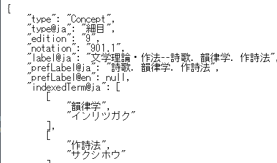

## プロジェクトの目標

日本十進分類（NDC）をソフトウェアやウェブサービスを開発・運用する際により扱いやすくすることを目指します。また開発成果を継続的に維持することで、開発者の負担を軽減し、NDCをより活用しやすくします。そのために、例えば次のようなことに取り組みます。このプロジェクトは、オープンソースプロジェクトであり、誰でも参加することができます。

- 扱いやすいデータ形式や標準的なAPIを考える
- 主要な言語のライブラリやREST-APIの提供など実用的に運用する
- 開発成果はオープンソース・オープンデータとして公開する

## ベータ版API(2019/4/1公開)

 

- [動作サンプル](https://ndc-api-beta.arukascloud.io/)
- [GitHub](https://github.com/ndc-dev/python-parser)

## 日本十進分類法のIME辞書(2019/4/1公開)

 

活用事例として、データをもとにIMEの辞書ファイルを作成しました。

- [GitHub](https://github.com/ndc-dev/ndc-ime-dic)

## スケジュール

- 2019月4月 プロジェクト開始
- 2019年夏頃 REST-APIの正式提供開始

## 情報源

- [NDCオープンデータのリポジトリ](https://github.com/ndc-dev/opendata)
- [日本図書館協会が提供するオープンデータの説明](https://www.jla.or.jp/committees/bunrui//tabid/789/Default.aspx)
- [ndc8・ndc9データ一覧（暫定版）（PDF）](https://www.jla.or.jp/Portals/0/data/iinkai/bunrui/1_NDC%E3%83%87%E3%83%BC%E3%82%BF%E4%B8%80%E8%A6%A7%EF%BC%88%E6%9A%AB%E5%AE%9A%E7%89%88%EF%BC%89.pdf)

## コミュニティ

#### Slackに参加しよう

Code4Lib JAPANのSlack内にてグループを立ち上げる予定です。ぜひご参加ください。

http://wiki.code4lib.jp/wiki/C4ljp2018#Code4Lib_JAPAN_slack

#### このページを編集する

このページは[GitHub](https://github.com/ndc-dev/web)で管理されています。README.mdを編集してプルリクエストを送信することにより、ウェブページを更新できます。

